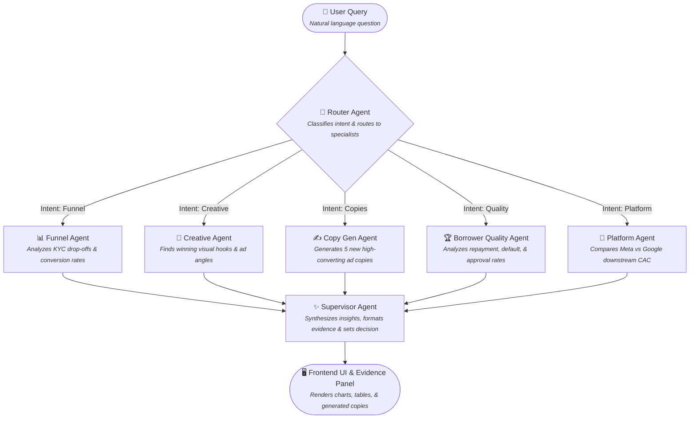

# 🤖 Performance Marketing Copilot

[](https://opensource.org/licenses/MIT)
[](https://www.python.org/)
[](CONTRIBUTING.md)
[](#)

An agentic, multi-specialist performance marketing Copilot framework designed to connect top-of-funnel ad campaigns with bottom-of-funnel business outcomes.

---

## 🎯 Objective
Performance marketers often optimize campaigns for shallow, vanity metrics (such as Cost Per Install or Cost Per Registration) because deep-funnel data (like user onboarding progress, loan approvals, transaction volumes, and customer lifetime value) is locked in siloed databases.

**Performance Marketing Copilot** bridges this gap. It provides marketers and teams with an intelligent, conversational interface to query deep-funnel user quality, analyze creative/ad platform effectiveness, and dynamically generate new, high-converting ad copy based on patterns that actually yield high-value, profitable customers.

While initialized here with a **Digital Lending (LoanGrowth)** template, the underlying architecture is **100% modular and extensible**—allowing you to easily swap schemas, plug in your own marketing data, and build custom specialist agents for any vertical (SaaS, E-commerce, EdTech, etc.).

---

## 📊 Data Schema
The copilot operates over a unified data model that connects top-of-funnel ad spend to deep-funnel outcomes. The default schema includes:

1. **Daily Spend (`daily_spend`)**: Contains daily advertising metrics including impressions, clicks, installs, and spend across platforms (Meta, Google).
2. **Attribution (`attribution`)**: Maps ad engagements to specific `user_id`s, acting as the bridge between ad platforms and the product funnel.
3. **Onboarding (`onboarding`)**: Tracks the user's progression through the KYC (Know Your Customer) funnel.
4. **Loan Outcomes (`loan_outcomes`)**: Records whether a user's loan application was approved, rejected, and successfully disbursed.
5. **Repayment (`repayment`)**: Tracks the ultimate profitability metric—whether the borrower successfully repaid the loan or defaulted.
6. **Creative Library (`creative_library`)**: A taxonomy of the actual ad assets, including copy angles, visual hooks, urgency indicators, and trust signals.

---

## 🧠 System Architecture

The application is built on a **Flask + Vanilla JS** stack, powered by **LangChain** and **OpenAI (GPT-4o)** using a multi-agent orchestration pattern.

### 1. The Multi-Agent Pipeline
When a user asks a question, it flows through a strict, 3-layer agentic architecture:



*   **Router Agent:** The traffic controller. It uses an LLM to analyze the user's intent alongside the conversation history (e.g., `COPY_GENERATION`, `PERFORMANCE`, `FUNNEL`). It then decides exactly which specialist agents need to be triggered to gather the required data.
*   **Specialist Agents:** The data analysts. These are discrete, tool-equipped agents. Depending on the route, the specific agent runs Python/Pandas functions to slice the underlying data and generate localized insights:
    *   *Funnel Agent*: Looks at where users drop off during the onboarding process.
    *   *Creative Agent*: Identifies which ad hooks and angles drive the highest quality users.
    *   *Copy Gen Agent*: Uses the winning creative patterns to generate completely new, highly-targeted ad copies.
    *   *Borrower Quality Agent*: Looks past the cost-per-install (CPI) to see if the acquired users actually repay or yield high LTV.
    *   *Platform Agent*: Evaluates whether Meta or Google drives better downstream profitability.
*   **Supervisor Agent:** The executive summarizer. It receives the raw analytical outputs from all the active specialists. It synthesizes this data into a strict JSON schema containing a definitive `decision`, the `why`, actionable `action_items`, and safely formats any generated ad copies to be rendered visually in the dynamic Evidence Panel.

### 2. Asynchronous Streaming & Memory
*   **Rolling Memory Context:** The backend persists the latest 3 rounds of conversation (6 messages) as rolling context, allowing for natural, conversational follow-up questions.
*   **Server-Sent Events (SSE):** The Flask backend uses SSE to stream execution progress in real-time to the frontend (e.g., *"🔀 Routing your question..."* ➔ *"⚙️ Running copy_gen..."* ➔ *"✨ Synthesizing insights..."*), providing a highly responsive UX.

### 3. Frontend Presentation
*   **Stateless UI:** The frontend acts as a thin client. It dynamically renders Markdown responses using `marked.js` and plots deep-funnel data using `Plotly.js`.
*   **Dynamic Evidence Panel:** Alongside textual advice, the UI conditionally renders charts (Funnels, Bar charts) or tabular data (Winning Creatives, Copy Variants) based on the evidence type requested by the Supervisor.

---

## 🛠️ Extending the Copilot (Add Your Own Agents)
To customize the Copilot for your business (e.g., SaaS subscription funnels or eCommerce purchases):
1.  **Modify the Data**: Place your dataset in the `data/` folder and update the schemas.
2.  **Define a Specialist Agent**: Add your new agent definition in `agents/specialists.py` (e.g., a `SaaSSubscriptionAgent`).
3.  **Update the Router & Supervisor**: Update the routing logic and prompts inside the orchestrator to identify and synthesize outcomes from your new agent.

---

## 🚀 Local Development

1.  **Install dependencies:**
    ```bash
    pip install -r requirements.txt
    ```
2.  **Environment Variables:**
    Create a `.env` file in the root directory and add your OpenAI API key:
    ```env
    OPENAI_API_KEY=sk-your-api-key
    ```
3.  **Run the server:**
    ```bash
    python3 app.py
    ```
4.  **Access the application:**
    Navigate to `http://localhost:5000` in your web browser.

---

## 🤝 Contributing
Contributions make the open-source community an amazing place to learn, inspire, and create. Please read our **[Contributing Guidelines](CONTRIBUTING.md)** and check out our **[Code of Conduct](CODE_OF_CONDUCT.md)** to get started!

---

## 📄 License
Distributed under the MIT License. See **[LICENSE](LICENSE)** for more information.
